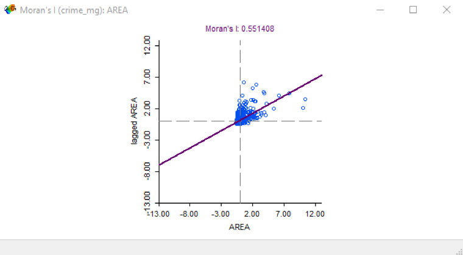
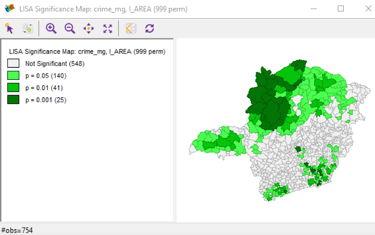
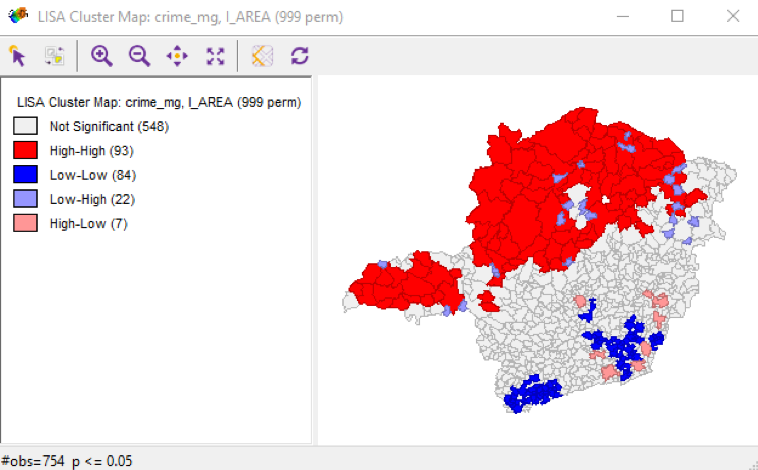
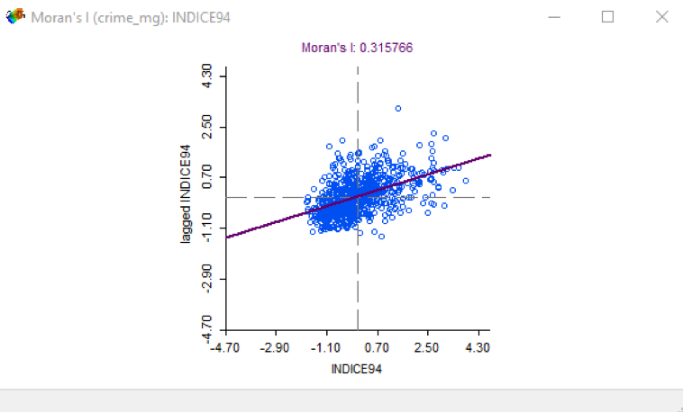
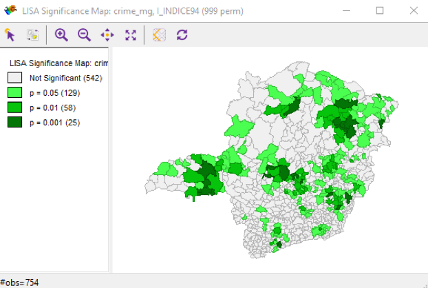
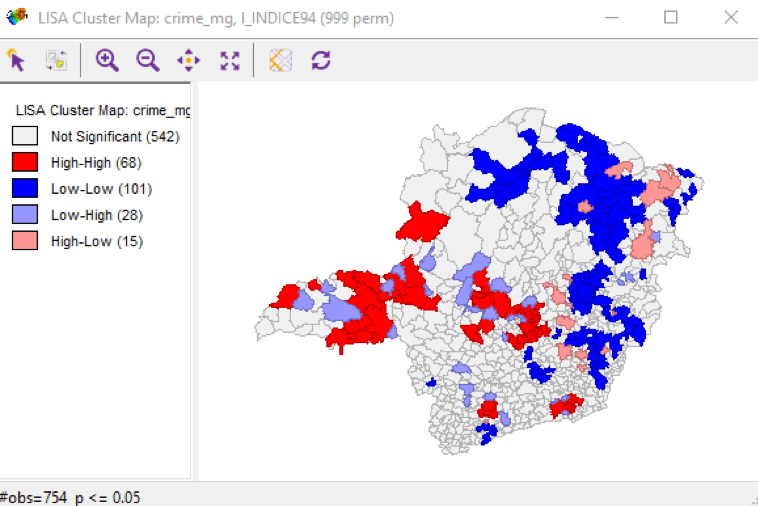
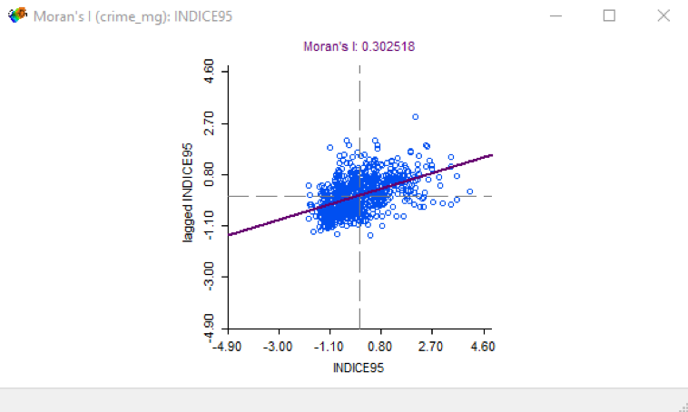
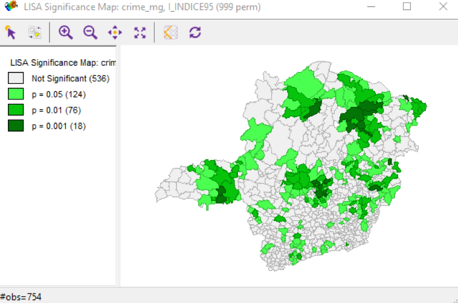
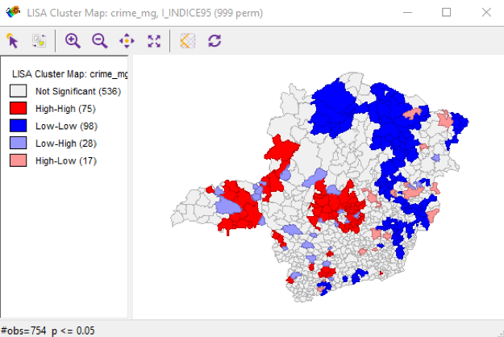
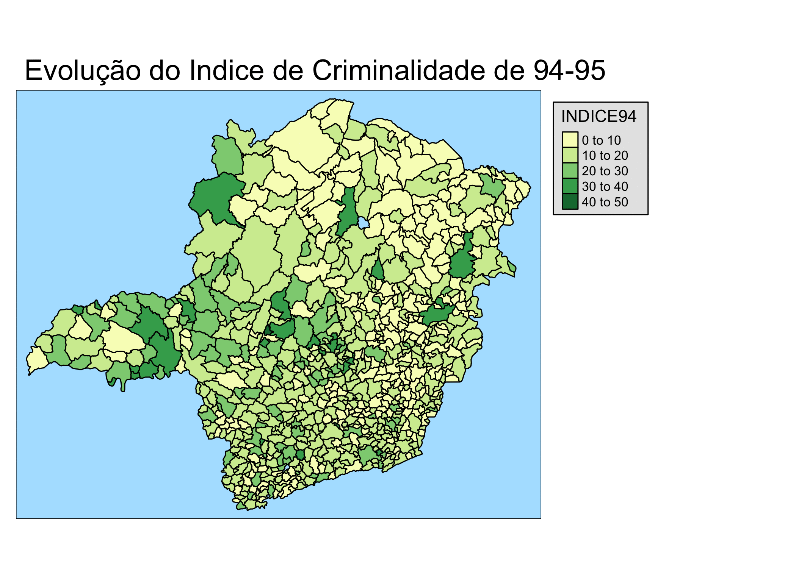

```{r setup, include=FALSE}
knitr::opts_chunk$set(echo = TRUE)
```

```{r Inicia Ambiente, message=FALSE, include=FALSE}
#Iniciando o ambiente
rm(list = ls())
cat("\014") 
```

```{r Carrega bibliotecas necessarias, message=FALSE, warning=TRUE, include=FALSE}
#Load required packages
if(!require(maps)) {
  install.packages("maps")
  library(maps)
}

if(!require(maptools)) {
  install.packages("maptools")
  library(maptools)
}

if(!require(sp)) {
  install.packages("sp")
  library(sp)
}

if(!require(spdep)) {
  install.packages("spdep")
  library(spdep)
}

if(!require(ggmap)) {
  install.packages("gstat")
  library(ggmap)
}

if(!require(splancs)) {
  install.packages("splancs")
  library(splancs)
}

if(!require(spatstat)) {
  install.packages("spatstat")
  library(spatstat)
}

if(!require(RColorBrewer)) {
  install.packages("RColorBrewer")
  library(RColorBrewer)
}

if(!require(classInt)) {
  install.packages("classInt")
  library(classInt)
}

if(!require(spgwr)) {
  install.packages("spgwr")
  library(spgwr)
}

if(!require(ggmap)) {
  install.packages("ggmap")
  library(ggmap)
}

if(!require(gpclib)) {
  install.packages("gpclib")
  library(gpclib)
}

if(!require(rgdal)) {
  install.packages("rgdal")
  library(rgdal)
}

if(!require(tmap)) {
  install.packages("tmap")
  library(tmap)
}


if(!require(ncf)) {
  install.packages("ncf")
  library(ncf)
}

```

Leio o Shapefile crime_mg:

```{r Preparacao dos dados - Leitura do Shapefile, message=FALSE}
crime_mg<- readOGR(dsn = "crime_mg", layer = "crime_mg",verbose = TRUE, use_iconv = TRUE, p4s = "+proj=longlat +ellps=WGS84")
names(crime_mg)
summary(crime_mg)
```

Mapa de Minas Gerais com os municipios, como no shapefile, sem tema:
```{r plot do mapa de Minas Gerais sem tema}

tmap::qtm(crime_mg,title = "Mapa de Minas Gerais")

```


Pergunta 1
Qual das variáveis quantitativas apresentadas no shapefile crime_mg apresenta maior auto-correlação espacial? Descreva como implementou a matriz de vizinhança. Apresente o I de Moran e o mapa de auto-correlação espacial local (LISA map) da variável escolhida e também de pelo menos outras 3 variáveis.
Obs: desconsidere as variáveis Codmuni, ID, X_coord e Y_coord nessa análise.


Calculo de Moran's I para vericação da auto-correlação espacial das variáveis usamos a metodologia Rainha (queen) na matriz de vizinhanca:

```{r calculo do Moran I}

crime_mg_nb = poly2nb(crime_mg, queen=TRUE, row.names=crime_mg$X_COORD)

crime_mg_w <- nb2listw(crime_mg_nb, style="W")

cmg_munic <- crime_mg$MUNIC
cmg_area <- crime_mg$AREA
cmg_indice94 <- crime_mg$INDICE94
cmg_indice95 <- crime_mg$INDICE95
cmg_gini_91 <- crime_mg$GINI_91
cmg_pop_94 <- crime_mg$POP_94
cmg_pop_rur <- crime_mg$POP_RUR
cmg_pop_urb <- crime_mg$POP_URB
cmg_pop_fem <- crime_mg$POP_FEM
cmg_pop_mas <- crime_mg$POP_MAS
cmg_pop_tot <- crime_mg$POP_TOT
cmg_urblevel <- crime_mg$URBLEVEL
cmg_pib_pc <- crime_mg$PIB_PC

moran_i_munic <- moran(cmg_munic,crime_mg_w, length(crime_mg_nb), Szero(crime_mg_w))
moran_i_area <- moran(cmg_area,crime_mg_w, length(crime_mg_nb), Szero(crime_mg_w))
moran_i_indice94 <- moran(cmg_indice94,crime_mg_w, length(crime_mg_nb), Szero(crime_mg_w))
moran_i_indice95 <- moran(cmg_indice95,crime_mg_w, length(crime_mg_nb), Szero(crime_mg_w))
moran_i_gini_91 <- moran(cmg_gini_91,crime_mg_w, length(crime_mg_nb), Szero(crime_mg_w))
moran_i_pop_94 <- moran(cmg_pop_94,crime_mg_w, length(crime_mg_nb), Szero(crime_mg_w))
moran_i_pop_rur <- moran(cmg_pop_rur,crime_mg_w, length(crime_mg_nb), Szero(crime_mg_w))
moran_i_pop_urb <- moran(cmg_pop_urb,crime_mg_w, length(crime_mg_nb), Szero(crime_mg_w))
moran_i_pop_fem <- moran(cmg_pop_fem,crime_mg_w, length(crime_mg_nb), Szero(crime_mg_w))
moran_i_pop_mas <- moran(cmg_pop_mas,crime_mg_w, length(crime_mg_nb), Szero(crime_mg_w))
moran_i_pop_tot <- moran(cmg_pop_tot,crime_mg_w, length(crime_mg_nb), Szero(crime_mg_w))
moran_i_urblevel <- moran(cmg_urblevel,crime_mg_w, length(crime_mg_nb), Szero(crime_mg_w))
moran_i_pib_pc <- moran(cmg_pib_pc,crime_mg_w, length(crime_mg_nb), Szero(crime_mg_w))
```

Mostrando todas as auto-correlações:
```{r apresentacao das autocorrelacoes em ordem decrescente}
moran <- c("label","i")
label <- c("moran_i_munic",
  "moran_i_area",
  "moran_i_indice94",
  "moran_i_indice95",
  "moran_i_gini_91",
  "moran_i_pop_94",
  "moran_i_pop_rur",
  "moran_i_pop_urb",
  "moran_i_pop_fem",
  "moran_i_pop_mas",
  "moran_i_pop_tot",
  "moran_i_urblevel",
  "moran_i_pib_pc"
)

moran_i <- c(moran_i_munic$I
  ,moran_i_area$I
  ,moran_i_indice94$I
  ,moran_i_indice95$I
  ,moran_i_gini_91$I
  ,moran_i_pop_94$I
  ,moran_i_pop_rur$I
  ,moran_i_pop_urb$I
  ,moran_i_pop_fem$I
  ,moran_i_pop_mas$I
  ,moran_i_pop_tot$I
  ,moran_i_urblevel$I
  ,moran_i_pib_pc$I
)

moran <- data.frame(label = label, moran_i = moran_i)

moran[order(moran$moran_i,decreasing = TRUE),]

```

Mostrando Moran's I das variáveis AREA, INDICE94 e INDICE95, que possuem os maiores I:

```{r plot do Moran I para as variaveis com maior I}
{
  moran.plot(x = cmg_area,listw = crime_mg_w,labels = FALSE)
  title("Moran's I de AREA")
  moran.plot(x = cmg_indice94,listw = crime_mg_w,labels = FALSE)
  title("Moran's I de INDICE94")
  moran.plot(x = cmg_indice95,listw = crime_mg_w,labels = FALSE)
  title("Moran's I de INDICE95")
}

```

Calculando LISA

Verificando a média de links entre vizinhos:
```{r identificando media de vizinhos no dataset}
crime_mg_nb
```
Como a média de links é 5.7, passamos como parâmetro para o lisa que serão 6 vizinhos:

```{r calculo do LISA para as variaveis AREA - INDICE94 - INDICE95}

LISA_AREA <- lisa(x = crime_mg$X_COORD, y = crime_mg$Y_COORD, z = crime_mg$AREA, neigh = 5.7)
LISA_INDICE94 <- lisa(x = crime_mg$X_COORD, y = crime_mg$Y_COORD, z = crime_mg$INDICE94, neigh = 5.7)
LISA_INDICE95 <- lisa(x = crime_mg$X_COORD, y = crime_mg$Y_COORD, z = crime_mg$INDICE95, neigh = 5.7)

```

Plot dos mapas LISA:
```{r plot dos mapas LISA}

crime_mg$LISA_AREA_p <- LISA_AREA$p
crime_mg$LISA_INDICE94_p <- LISA_INDICE94$p
crime_mg$LISA_INDICE95_p <- LISA_INDICE95$p

crime_mg$LISA_AREA_corr <- LISA_AREA$correlation
crime_mg$LISA_INDICE94_corr <- LISA_INDICE94$correlation
crime_mg$LISA_INDICE95_corr <- LISA_INDICE95$correlation

tmap::tm_shape(crime_mg, simplify = 1) + 
  tmap::tm_polygons() +
  tmap::tm_shape(crime_mg, simplify = 1) +
  tmap::tm_fill(c("LISA_AREA_p","LISA_AREA_corr"), midpoint = 0) +
  tmap::tm_style("natural")

tmap::tm_shape(crime_mg) +
  tmap::tm_polygons() +
  tmap::tm_shape(crime_mg, simplify = 1) +
  tmap::tm_fill(c("LISA_INDICE94_p","LISA_INDICE94_corr"), midpoint = 0) + 
  tmap::tm_style("natural")

tmap::tm_shape(crime_mg) +
  tmap::tm_polygons() +
  tmap::tm_shape(crime_mg, simplify = 1) +
  tmap::tm_fill(c("LISA_INDICE95_p","LISA_INDICE95_corr"), midpoint = 0) + 
  tmap::tm_style("natural") 

```

Fizemos também a implementação dos mapas LISA no GeoDa, e estes foram diferentes do apresentado aqui. Abaixo, os gráficos gerados no GeoDa:

```{r}











```


Pergunta 2
Implemente o modelo espacial auto-regressivo (SAR) da variável Indice95 (índice de criminalidade em 1995 de Minas Gerais) a partir de apenas uma variável independente (não pode ser Indice94, Codmuni, ID, X_coord nem Y_coord). Apresente o resultado da regressão linear simples e da regressão linear espacial. Apresente as equações e interprete seus coeficientes.

Regrssão linear simples
```{r regressao linear simples}
ap <- as.data.frame(cbind(crime_mg$MUNIC, crime_mg$AREA, crime_mg$INDICE94,
                          crime_mg$INDICE95, crime_mg$GINI_91, crime_mg$POP_94,
                          crime_mg$POP_RUR, crime_mg$POP_URB, crime_mg$POP_FEM,
                          crime_mg$POP_MAS, crime_mg$POP_TOT, crime_mg$URBLEVEL,
                          crime_mg$PIB_PC))
colnames(ap) <- c("ID",names(crime_mg@data[4:15]))

head(ap)

lmK <- lm(formula = crime_mg$INDICE95 ~ URBLEVEL, data = ap)

summary(lmK)

```

Regressão linear espacial - SAR

```{r regressao linear espacial - SAR}

ap <- as.data.frame(cbind(crime_mg$MUNIC, crime_mg$AREA, crime_mg$INDICE94,
                          crime_mg$INDICE95, crime_mg$GINI_91, crime_mg$POP_94,
                          crime_mg$POP_RUR, crime_mg$POP_URB, crime_mg$POP_FEM,
                          crime_mg$POP_MAS, crime_mg$POP_TOT, crime_mg$URBLEVEL,
                          crime_mg$PIB_PC))
colnames(ap) <- c("ID",names(crime_mg@data[4:15]))

crime_mg_nb = poly2nb(crime_mg, queen=TRUE, row.names=crime_mg$X_COORD)
crime_mg_w <- nb2listw(crime_mg_nb, style="W")

sar.ap <- lagsarlm(crime_mg$INDICE95 ~ URBLEVEL,data=ap,crime_mg_w,method="Matrix")
  
SARk_SSE <- sar.ap$SSE

SST <- sum((ap$INDICE95 - mean(ap$INDICE95))^2)

r2_SARk <- 1 - (SARk_SSE/SST)
r2_SARk

summary(sar.ap)

```


Pergunta 3
Para essa variável que você escolheu, o modelo espacial SAR apresentou ganhos significantes com relação ao modelo linear simples? Justifique sua resposta.
Obs: Sugere-se fazer essa atividade no GeoDA ou no R.

```{r comparacao de SAR e LM}
cat("Rˆ2 SAR: ",r2_SARk, "\n")
cat("Rˆ2 LM:",summary(lmK)$adj.r.squared,"\n")
```

O modelo espacial SAR apresentou ganho de 8% versus o modelo linear simples.


Pergunta 4
Implemente a regressão espacial GWR da variável Indice95 (índice de criminalidade em 1995 de Minas Gerais) a partir de apenas uma variável independente (não pode ser Indice94, Codmuni, ID, X_coord nem Y_coord). Apresente o resultado da regressão linear simples e da regressão linear espacial por GWR. Apresente medidas da distribuição dos coeficientes (min, Q1, Q2, Q3, máx), e da distribuição do R2 (min, Q1, Q2, Q3, máx) e apresente os resultados globais da regressão (R2 global, basicamente).
Obs: Sugere-se fazer essa atividade no ArcGIS ou no R.

```{r calculo do modelo de regressao GWR}

coords <- cbind(crime_mg$X_COORD,crime_mg$Y_COORD)
colnames(coords) <- c("X","Y")

ap <- as.data.frame(cbind(crime_mg$MUNIC, crime_mg$AREA, crime_mg$INDICE94,
                          crime_mg$INDICE95, crime_mg$GINI_91, crime_mg$POP_94,
                          crime_mg$POP_RUR, crime_mg$POP_URB, crime_mg$POP_FEM,
                          crime_mg$POP_MAS, crime_mg$POP_TOT, crime_mg$URBLEVEL,
                          crime_mg$PIB_PC))
colnames(ap) <- c("ID",names(crime_mg@data[4:15]))

bwGauss <- gwr.sel(crime_mg$INDICE95 ~ URBLEVEL,data=ap,coords=coords,adapt=TRUE,method="aic",
                   gweight=gwr.Gauss,verbose=FALSE)

gwr.ap <- gwr(crime_mg$INDICE95 ~ URBLEVEL, data=ap,coords=coords,bandwidth=bwGauss,
               gweight=gwr.Gauss,adapt=bwGauss,hatmatrix=TRUE)
gwr.ap
 
GWR_SSE <- gwr.ap$results$rss
r2_GWR <- 1 - (GWR_SSE/SST)
r2_GWR

```


Pergunta 5
Para essa variável que você escolheu, o modelo espacial GWR apresentou ganhos significantes com relação ao modelo linear simples? Justifique sua resposta.

```{r comparacao de SAR e GWR}

cat("Rˆ2 SAR: ",r2_SARk, "\n")
cat("Rˆ2 GWR: ",r2_GWR, "\n")

```
GWR Aumenta 15% o ganho em relação ao SAR.


Pergunta 6
Implemente um modelo de regressão linear multivariado stepwise da variável Indice95 (significante a 5% ou 10%, utilize o que achar melhor). Depois, “promova-o” a um modelo SAR. Apresente os resultados comparados (equação, R2). Qual modelo você escolheria como final? Se desejar, apresente mapas que sustente sua justificativa.

```{r implementaçao do modelo multivariado stepwise - regressao simples}

ap <- as.data.frame(cbind(crime_mg$MUNIC, crime_mg$AREA, crime_mg$INDICE94,
                          crime_mg$INDICE95, crime_mg$GINI_91, crime_mg$POP_94,
                          crime_mg$POP_RUR, crime_mg$POP_URB, crime_mg$POP_FEM,
                          crime_mg$POP_MAS, crime_mg$POP_TOT, crime_mg$URBLEVEL,
                          crime_mg$PIB_PC))
colnames(ap) <- c("ID",names(crime_mg@data[4:15]))

lm.ap <- step(lm(crime_mg$INDICE95 ~ ., data=ap))
lm.ap
summary(lm.ap)

lmKmv <- lm(formula = crime_mg$INDICE95 ~ INDICE94 + GINI_91 + URBLEVEL, 
    data = ap)

summary(lmKmv)
```

```{r implementaçao do modelo multivariado stepwise - regressao SAR}

ap <- as.data.frame(cbind(crime_mg$MUNIC, crime_mg$AREA, crime_mg$INDICE94,
                          crime_mg$INDICE95, crime_mg$GINI_91, crime_mg$POP_94,
                          crime_mg$POP_RUR, crime_mg$POP_URB, crime_mg$POP_FEM,
                          crime_mg$POP_MAS, crime_mg$POP_TOT, crime_mg$URBLEVEL,
                          crime_mg$PIB_PC))
colnames(ap) <- c("ID",names(crime_mg@data[4:15]))

sarmv.ap <- lagsarlm(crime_mg$INDICE95 ~ INDICE94 + GINI_91 +
                     URBLEVEL,data=ap,crime_mg_w,method="Matrix")
  
SARkmv_SSE <- sarmv.ap$SSE

SST <- sum((ap$INDICE95 - mean(ap$INDICE95))^2)

r2_SARkmv <- 1 - (SARkmv_SSE/SST)
r2_SARkmv

summary(sarmv.ap)

```

```{r comparacao de SAR e LM Multi-variado}
cat("Rˆ2 SAR: ",r2_SARk, "\n")
cat("Rˆ2 LM:",summary(lmK)$adj.r.squared,"\n")
cat("Rˆ2 SAR MV: ",r2_SARkmv, "\n")
cat("Rˆ2 LM MV:",summary(lmKmv)$adj.r.squared,"\n")
```
No modelo multivariado o ganho é de 1% do modelo linear simples para o modelo SAR, porém o ganho foi de +37% com relacao ao modelo original univariado.

Pergunta 7 (bônus)
Promova o modelo final linear da Pergunta 6 a um modelo GWR. Apresente os resultados comparados (equação, R2). Qual modelo você escolheria como final? Se desejar, apresente mapas que sustente sua justificativa.

```{r implementaçao do modelo multivariado stepwise - regressao GWR}

bwGaussMV <- gwr.sel(crime_mg$INDICE95 ~ INDICE94 + GINI_91 + URBLEVEL,data=ap,coords=coords,adapt=TRUE,method="aic",
                   gweight=gwr.Gauss,verbose=FALSE)

gwrMV.ap <- gwr(crime_mg$INDICE95 ~ INDICE94 + GINI_91 +
                 URBLEVEL, data=ap,coords=coords,bandwidth=bwGauss,
               gweight=gwr.Gauss,adapt=bwGaussMV,hatmatrix=TRUE)
gwrMV.ap

SST <- sum((ap$INDICE95 - mean(ap$INDICE95))^2)
 
GWR_MV_SSE <- gwrMV.ap$results$rss
r2_GWR_MV <- 1 - (GWR_MV_SSE/SST)
r2_GWR_MV

```

Comparando os resultados finais:
```{r comparacao de GWR - SAR - LM Multi-variado}
cat("Rˆ2 GWR: ",r2_GWR, "\n")
cat("Rˆ2 SAR: ",r2_SARk, "\n")
cat("Rˆ2 LM:",summary(lmK)$adj.r.squared,"\n")
cat("Rˆ2 GWR MV: ",r2_GWR_MV, "\n")
cat("Rˆ2 SAR MV: ",r2_SARkmv, "\n")
cat("Rˆ2 LM MV:",summary(lmKmv)$adj.r.squared,"\n")
```
Notamos que o modelo GWR tambem e' beneficiado por uma analise multivariada, tendo aumentado 27%, passando de 48.1% para 75%.


Tarefa 8 (bônus 2)
Produza um mapa de alta qualidade do shapefile crime_mg utilizando a extensão tmap. Os dois grupos que produzirem os melhores mapas ganharão 0,5 ponto adicional na nota da atividade.
Apresente o código completo e o mapa produzido em sua resposta.

```{r plotando mapas com tmap}

ani_map <- tmap::tm_shape(crime_mg, simplify = 1) + 
  tmap::tm_fill() +
  tmap::tm_shape(crime_mg) + 
  tmap::tm_fill(c("INDICE94","INDICE95")) +
  tmap::tm_style(style = "natural", legend.outside = TRUE) +
  tmap::tm_facets(free.scales.symbol.size = FALSE, nrow=1,ncol=1) +
  tmap::tm_layout(main.title = "Evolução do Indice de Criminalidade de 94-95") +
  tmap::tm_polygons()

tmap_animation(ani_map, loop = TRUE, delay=100, filename = "CRIME_MG.gif")



```
